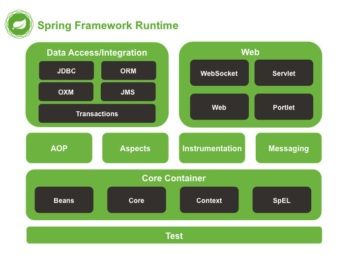

## Spring

### spring 的体系结构

</img>

### 工厂模式解耦

在实际开发中我们可以把三层的对象都使用配置文件配置起来，当启动服务器应用加载的时候，让一个类中的方法通过*读取配置文件*，把这些对象*创建*出来并*存起来*。在接下来的使用的时候，直接拿过来用就好了。

那么，这个读取配置文件，创建和获取三层对象的类就是工厂。

### BeanFactory 和 ApplicationContext 的区别

* BeanFactory 是 Spring 容器中的顶层接口；ApplicationContext 是它的子接口。

* 创建对象的时间点不一样。

    * BeanFactory：延迟加载；什么时候用什么时候创建对象。
    
    * ApplicationContext：立即加载；只要一读取配置文件，默认情况下就会创建对象。
    
### ApplicationContext 接口的实现类

* ClassPathXmlApplicationContext：从类的根路径下加载配置文件----**推荐使用这种**

* FileSystemXmlApplicationContext：从磁盘路径上加载配置文件，配置文件可以在磁盘的任意位置。

* AnnotationConfigApplicationContext:当我们使用注解配置容器对象时，需要使用此类来创建 spring 容器。它用来读取注解。但测试类中一般不会用，一般都是用spring-test创建容器

### bean 标签

* 作用：用于配置对象让 spring 来创建的。**默认情况下它调用的是类中的无参构造函数。如果没有无参构造函数则不能创建成功**。

* 属性：

  * id： 给对象在容器中提供一个唯一标识。用于获取对象。

  * class： 指定类的全限定类名。用于反射创建对象。默认情况下调用无参构造函数。

  * scope： 指定对象的作用范围。

    * singleton :默认值，单例的.

    * prototype :多例的.

    * request :WEB 项目中,Spring 创建一个 Bean 的对象,将对象存入到 request 域中.

    * session :WEB 项目中,Spring 创建一个 Bean 的对象,将对象存入到 session 域中.

    * global session :WEB 项目中,应用在 Portlet 环境.如果没有 Portlet 环境那么globalSession 相当于 session.

* init-method： 指定类中的初始化方法名称。

* destroy-method： 指定类中销毁方法名称。

### bean 的作用范围和生命周期

* 单例对象： scope="singleton"（存在线程安全问题）
  
  * 一个应用只有一个对象的实例。它的作用范围就是整个应用。

  * 生命周期：创建容器时，对象就被创建了。只要*容器*在，对象一直活着。当应用卸载，销毁容器时，对象就被销毁了。

* 多例对象： scope="prototype"

  * 每次访问对象时，都会重新创建对象实例。

  * 生命周期：当*使用对象*时，创建新的对象实例。只要对象在使用中，就一直活着。当对象长时间不用时，被 java 的*垃圾回收器*回收了。

### 实例化 Bean 的三种方式

第一种方式：使用默认无参构造函数
```xml
<bean id="accountService" class="com.iccKevin.com.AccountServiceImpl"/>
```

第二种方式： spring 管理静态工厂-使用静态工厂的方法创建对象
```java
/**
* 模拟一个静态工厂，创建业务层实现类
*/
public class StaticFactory {
    public static IAccountService createAccountService(){
        return new AccountServiceImpl();
    }
}
```

```xml
<!-- 此种方式是:
使用 StaticFactory 类中的静态方法 createAccountService 创建对象，并存入 spring 容器
id 属性：指定 bean 的 id，用于从容器中获取
class 属性：指定静态工厂的全限定类名
factory-method 属性：指定生产对象的静态方法
-->
<bean id="accountService"
class="com.iccKevin.factory.StaticFactory"
factory-method="createAccountService"></bean>
```

第三种方式： spring 管理实例工厂-使用实例工厂的方法创建对象
```java
/**
* 模拟一个实例工厂，创建业务层实现类
* 此工厂创建对象，没有构造函数可以调用，必须先有工厂实例对象，再调用方法
*/
public class InstanceFactory {
    public IAccountService createAccountService(){
        return new AccountServiceImpl();
    }
}
```
```xml
<!-- 此种方式是：
先把工厂的创建交给 spring 来管理。
然后在使用工厂的 bean 来调用里面的方法
factory-bean 属性：用于指定实例工厂 bean 的 id。
factory-method 属性：用于指定实例工厂中创建对象的方法。
-->
<bean id="instanceFactory" class="com.iccKevin.factory.InstanceFactory"></bean>
<bean id="accountService"
factory-bean="instanceFactory"
factory-method="createAccountService"></bean>
```

### spring中的依赖注入

在当前类需要用到其他类的对象，由spring为我们提供，我们只需要在配置文件中说明.依赖关系的维护就称之为依赖注入。

* 能注入的数据：

    1.基本类型和String
    2.其他bean类型（在配置文件中或者注解配置过的bean）
    3.复杂类型/集合类型

* 注入的方式：

#### 1.使用构造函数提供（了解）
    
    使用的标签:constructor-arg
    标签出现的位置：bean标签的内部
    标签中的属性
        type：用于指定要注入的数据的数据类型，该数据类型也是构造函数中某个或某些参数的类型
        index：用于指定要注入的数据给构造函数中指定索引位置的参数赋值。索引的位置是从0开始
        name：用于指定给构造函数中指定名称的参数赋值（_常用的_）
        =============以上三个用于指定给构造函数中哪个参数赋值===============================
        value：用于提供基本类型和String类型的数据
        ref：用于指定其他的bean类型数据。它指的就是在spring的Ioc核心容器中出现过的bean对象
    
    优势：
        在获取bean对象时，注入数据是必须的操作，否则对象无法创建成功。
    弊端：
        改变了bean对象的实例化方式，使我们在创建对象时，如果用不到这些数据，也必须提供。

```xml
<bean id="accountService" class="com.iccKevin.com.AccountServiceImpl">
    <constructor-arg name="name" value="泰斯特"></constructor-arg>
    <constructor-arg name="age" value="18"></constructor-arg>
    <constructor-arg name="birthday" ref="now"></constructor-arg>
</bean>

<!-- 配置一个日期对象 -->
<bean id="now" class="java.util.Date"></bean>
```
#### 2.使用set方法提供

更常用的方式

涉及的标签：property

出现的位置：bean标签的内部

标签的属性

    name：用于指定注入时所调用的set方法名称

    value：用于提供基本类型和String类型的数据

    ref：用于指定其他的bean类型数据。它指的就是在spring的Ioc核心容器中出现过的bean对象

优势：

    创建对象时没有明确的限制，可以直接使用默认构造函数

弊端：

    如果有某个成员必须有值，则获取对象是有可能set方法没有执行。

```xml
<bean id="accountService2" class="com.iccKevin.com.iccKevin.service.impl.AccountServiceImpl2">
    <property name="name" value="TEST" ></property>
    <property name="age" value="21"></property>
    <property name="birthday" ref="now"></property>
</bean>
```
```java
/**
 * 账户的业务层实现类
 */
public class AccountServiceImpl2 implements IAccountService {

    //如果是经常变化的数据，并不适用于注入的方式
    private String name;
    private Integer age;
    private Date birthday;

    public void setName(String name) {
        this.name = name;
    }

    public void setAge(Integer age) {
        this.age = age;
    }

    public void setBirthday(Date birthday) {
        this.birthday = birthday;
    }

    public void  saveAccount(){
        System.out.println("service中的saveAccount方法执行了。。。"+name+","+age+","+birthday);
    }

}
```

* 如果是集合类的数据：

1.用于给List结构集合注入的标签：

    list array set
  
2.用于给Map结构集合注入的标签:

    map props

结构相同，标签可以互换

```xml
<bean id="accountService3" class="com.iccKevin.com.iccKevin.service.impl.AccountServiceImpl3">
    <property name="myStrs">
        <set>
            <value>AAA</value>
            <value>BBB</value>
            <value>CCC</value>
        </set>
    </property>

    <property name="myList">
        <array>
            <value>AAA</value>
            <value>BBB</value>
            <value>CCC</value>
        </array>
    </property>

    <property name="mySet">
        <list>
            <value>AAA</value>
            <value>BBB</value>
            <value>CCC</value>
        </list>
    </property>

    <property name="myMap">
        <props>
            <prop key="testC">ccc</prop>
            <prop key="testD">ddd</prop>
        </props>
    </property>

    <property name="myProps">
        <map>
            <entry key="testA" value="aaa"></entry>
            <entry key="testB" value="BBB"></entry>
        </map>
    </property>
</bean>
```
#### 3.使用注解提供

##### 用于创建对象的：相当于\<bean>标签
 
* Component:
   
    * 作用：用于把当前类对象存入spring容器中
     
    * value属性用于指定bean的id。当我们不写时，它的默认值是当前类名，且首字母改小写。如：@Component("suibianxie")
 
* Controller：一般用在表现层
 
* Service：一般用在业务层
 
* Repository：一般用在持久层
 
* 他们三个是spring框架为我们提供明确的三层使用的注解，使我们的三层对象更加清晰

*注意：记得在xml中导入约束*
 
##### 用于注入数据的：相当于bean标签中的\<property>标签
 
* Autowired:
 
  * **作用：自动按照容器中的bean对象类型注入。**
  
    * 只要容器中有唯一的一个bean对象类型和要注入的变量类型匹配，就可以注入成功
     
    * 如果ioc容器中没有任何bean的类型和要注入的变量类型匹配，则报错。
   
    * 如果Ioc容器中有多个类型匹配时：查找与变量名匹配的key，没有则报错
   
  * 出现位置：可以是变量上，也可以是方法上
   
  * 细节：在使用注解注入时，set方法就不是必须的了。
 
* Qualifier:
 
  * 作用：在按照类中注入的基础之上再按照名称注入。它在给类成员注入时不能单独使用，但是在给方法参数注入时可以

  * 属性：value：用于指定注入bean的id。
 
* Resource = Autowired + Qualifier
 
  * 作用：直接按照bean的id注入。它可以独立使用
   
  * 属性：name：用于指定bean的id。
 
* _以上三个注入都只能注入其他bean类型的数据，而基本类型和String类型无法使用上述注解实现。另外，集合类型的注入只能通过XML来实现。_
 
* Value
 
  * 作用：用于注入基本类型和String类型的数据
   
  * 属性：value：用于指定数据的值。支持spring中SpEL(也就是spring的el表达式）

##### 用于改变作用范围的：相当于bean标签中的scope属性

* Scope

  * 作用：用于指定bean的作用范围

  * 属性：value：指定范围的取值。常用取值：singleton(默认)，prototype

##### 和生命周期相关（了解）：相当于bean标签中的init-method和destroy-method属性

* PostConstruct

  * 作用：用于指定初始化方法

* PreDestroy

  * 作用：用于指定销毁方法

### 常用配置习惯

* 注入自己写的类，用注解；注入jar包中的，用xml

## spring基于注解的配置和一些新注解
 
 * @Configuration
 
     * 作用：指定当前类是一个配置类，相当于这是一个bean.xml文件
     
     * 细节：当配置类作为AnnotationConfigApplicationContext对象创建的参数时，该注解可以不写。
 
 * @ComponentScan
 
     * 作用：用于通过注解指定spring在创建容器时要扫描的包
     
     * 属性：value：它和basePackages的作用是一样的，都是用于指定创建容器时要扫描的包。
     
     * 我们使用此注解就等同于在xml中配置了:\<context:component-scan base-package="com.itheima"></context:component-scan>
 
 * @Bean
 
     * 作用：用于把当前方法的返回值作为bean对象存入spring的ioc容器中
     
     * 属性:name:用于指定bean的id。当不写时，默认值是当前方法的名称
     
     * 细节：
     
         * 当我们使用注解配置方法时，如果方法有参数，spring框架会去容器中查找有没有可用的bean对象。
         
         * 查找的方式和Autowired注解的作用是一样的：先匹配类型，再按指定名称找
 
 * @Import
 
     * 作用：用于导入其他的配置类
     
     * 属性：value：用于指定其他配置类的字节码。
     
     * 当我们使用Import的注解之后，有Import注解的类就是父配置类，而导入的都是子配置类
 
 * @PropertySource
 
     * 作用：用于指定properties文件的位置
     
     * 属性：value：指定文件的名称和路径。前面要加classpath，表示类路径下

### Spring整合junit的配置

 * 1、导入spring整合junit的坐标spring-test

 * 2、使用Junit提供的一个注解把原有的main方法替换了，替换成spring提供的@Runwith

 * 3、告知spring的运行器，spring和ioc创建是基于xml还是注解的，并且说明位置

     * @ContextConfiguration
    
         * locations：指定xml文件的位置，加上classpath关键字，表示在类路径下
        
         * classes：指定注解类所在地位置

 * 版本要求：junit>=4.12

### 事务管理

* 实现转账功能时，事务被自动控制了。换言之，我们使用了 connection 对象的 setAutoCommit(true)。

* 业务层：

```java
public class AccountServiceImpl implements IAccountService{
    @Override
    public void transfer(String sourceName, String targetName, Float money) {
        //根据名称查询两个账户信息
        Account source = accountDao.findByName(sourceName);
        Account target = accountDao.findByName(targetName);
        //转出账户减钱，转入账户加钱
        source.setMoney(source.getMoney()-money);
        target.setMoney(target.getMoney()+money);
        //更新两个账户
        accountDao.update(source);
        int i=1/0; //模拟转账异常
        accountDao.update(target);
        }
}
```

* 此方式控制事务，如果我们每次都执行一条 sql 语句，没有问题，但是该方法一次要执行多条 sql 语句，这种方式就无法实现功能了

* 改造：

```java
@Override
public class AccountServiceImpl implements IAccountService {
    public void transfer(String sourceName, String targetName, Float money) {
        try {
            TransactionManager.beginTransaction();

            // 把业务操作用事务包裹起来
            Account source = accountDao.findByName(sourceName);
            Account target = accountDao.findByName(targetName);
            source.setMoney(source.getMoney()-money);
            target.setMoney(target.getMoney()+money);
            accountDao.update(source);
            int i=1/0;
            accountDao.update(target);


            TransactionManager.commit();
        } catch (Exception e) {
            TransactionManager.rollback();
            e.printStackTrace();
        }finally {
            TransactionManager.release();
        }
    }
}
```

* _存在的问题：service层每个方法都要被事务管理包裹，重复代码多，并且业务层方法和事务控制方法耦合了。_

* 解决：动态代理AccountService。**原因：执行被代理对象的任何方法，都会经过invoke方法。可以添加事务控制对原有方法进行增强。**

### spring中的AOP

* 通知类型

</img>

#### spring中基于XML的AOP配置步骤

1、把通知Bean也交给spring来管理

2、使用aop:config标签表明开始AOP的配置

3、使用aop:aspect标签表明配置切面
   
    id属性：是给切面提供一个唯一标识
   
    ref属性：是指定通知类bean的Id。

4、在aop:aspect标签的内部使用对应标签来配置通知的类型

我们现在示例是让printLog方法在切入点方法执行之前之前：所以是前置通知

aop:before：表示配置前置通知

     method属性：用于指定Logger类中哪个方法是前置通知

     pointcut属性：用于指定切入点表达式，该表达式的含义指的是对业务层中哪些方法增强

* 切入点表达式的写法：

关键字：execution(表达式)

    表达式：
         访问修饰符  返回值  包名.包名.包名...类名.方法名(参数列表)
    标准的表达式写法：
     public void com.itheima.service.impl.AccountServiceImpl.saveAccount()
    访问修饰符可以省略
     void com.itheima.service.impl.AccountServiceImpl.saveAccount()
    返回值可以使用通配符，表示任意返回值
     * com.itheima.service.impl.AccountServiceImpl.saveAccount()
    包名可以使用通配符，表示任意包。但是有几级包，就需要写几个*.
     * *.*.*.*.AccountServiceImpl.saveAccount())
    包名可以使用..表示当前包及其子包
     * *..AccountServiceImpl.saveAccount()
    类名和方法名都可以使用*来实现通配
     * *..*.*()
    参数列表：
     可以直接写数据类型：
         基本类型直接写名称           int
         引用类型写包名.类名的方式   java.lang.String
     可以使用通配符表示任意类型，但是必须有参数
     可以使用..表示有无参数均可，有参数可以是任意类型
    全通配写法：
     * *..*.*(..)

 * 实际开发中切入点表达式的通常写法：
     
     * 切到业务层实现类下的所有方法 com.itheima.service.impl.*.*(..)
     
### spring中基于XML的声明式事务控制配置步骤

1、配置事务管理器DataSourceTransactionManager

2、配置事务的通知

        此时我们需要导入事务的约束 tx名称空间和约束，同时也需要aop的

        使用tx:advice标签配置事务通知

            属性：

                id：给事务通知起一个唯一标识txAdvice

                transaction-manager：给事务通知提供一个事务管理器引用

3、配置AOP中的通用切入点表达式

4、建立事务通知和切入点表达式的对应关系

5、配置事务的属性

       是在事务的通知tx:advice标签的内部
       isolation：用于指定事务的隔离级别。默认值是DEFAULT，表示使用数据库的默认隔离级别。
       propagation：用于指定事务的传播行为。默认值是REQUIRED，表示一定会有事务，增删改的选择。查询方法可以选择SUPPORTS。
       read-only：用于指定事务是否只读。只有查询方法才能设置为true。默认值是false，表示读写。
       timeout：用于指定事务的超时时间，默认值是-1，表示永不超时。如果指定了数值，以秒为单位。
       rollback-for：用于指定一个异常，当产生该异常时，事务回滚，产生其他异常时，事务不回滚。没有默认值。表示任何异常都回滚。
       no-rollback-for：用于指定一个异常，当产生该异常时，事务不回滚，产生其他异常时事务回滚。没有默认值。表示任何异常都回滚。